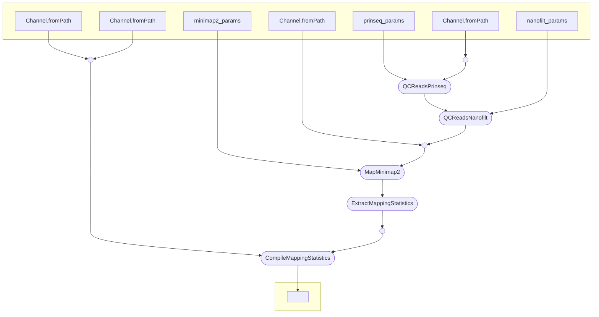

### ONT Reference Mapping deployment

Map multiple ONT reads to multiple reference genomes using minimap2 and extract mapping statistics.

Currently, the nextflow script needs to be edited to specify the input and output directories, and change the `params` section to specify the parameters for minimap2 and prinseq++ (optional).

#### Pipeline Dependencies

The pipeline requires the following software:

- minimap2
- prinseq++
- samtools

and the pandas python package.

These are included in the conda environment defined in the `environment.yml` file.

#### Pipeline Overview

