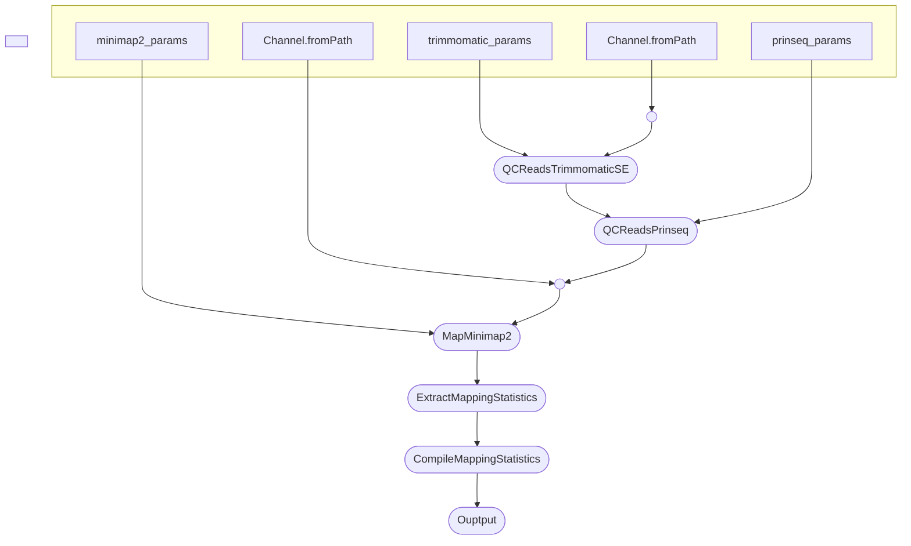

# Map References Tool

This tool is designed to map sequencing reads to reference genomes using Nextflow on the server. It leverages conda for environment management and Nextflow for workflow orchestration.

The default use case is to map Nanopore reads, with preprocessing using Nanofilt. However, through the argument `--technology` the user can specify `illumina` to map Illumina reads, with preprocessing using Trimmomatic. The tool will then use Minimap2 to map the reads to the reference genome in both cases.

### Outputs

The tool outputs a TSV file with the concatenated mapping statistics for all samples across all references (`samtools flagstat` output), in the output /mapping_stats directory.

The tool also outputs a report.html file on resource usage in the output directory.

## Prerequisites

Ensure you have the following installed on `genome1`:

- Conda
- Nextflow

## Usage

To use the tool, run the `map_references` script with the following positional arguments:

1. Path to the reference directory
2. Path to the FASTQ reads directory
3. FULL PATH to the output directory

### Example

```sh
map_references /path/to/references /path/to/reads /path/to/output
```

#### Pipeline Dependencies

The pipeline requires the following software:

- minimap2
- prinseq++
- samtools

and the pandas python package.

These are included in the conda environment defined in the `environment.yml` file.

### Pipeline Overview

#### Trimmomatic



#### Nanopore


